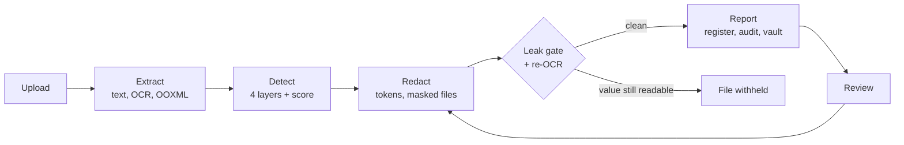

<div align="center">


# PII Shield

**Offline, fail-closed PII detection and redaction, so documents can go to an LLM without the people inside them.**


</div>

---

## Why

Built for the Optiv VIT case study. The client's policy forbids personal data from reaching AI models, yet the
documents they want an LLM to work on (a scanned policy PDF, a training DOCX full of screenshots, an organisation
PPTX) are full of names, IDs, e-mails and phone numbers.

Sending those files to a cloud OCR, a cloud PII API or a hosted LLM to *find* the PII would break the same
policy. So PII Shield runs entirely on one machine, and when it is unsure it redacts.

## What it does

| | |
|---|---|
| **Reads** | PDF (text and scanned), DOCX, PPTX, XLSX, images, e-mail, meeting transcripts, CSV and text, including comments, speaker notes, alt text, document properties and tracked changes |
| **Detects** | Four layers: rules with checksums, a local name model (spaCy), document structure, and propagation of every confirmed person across all files. 25+ categories, plus credentials in code and configuration |
| **Redacts** | Stable tokens (`Priya Raman` is `[PERSON_007]` in every file), LLM-ready Markdown, and masked copies that keep page count and layout. Faces, QR codes, unreadable pictures and text under a stamp are blanked |
| **Checks itself** | A leak gate searches every masked file for the original values, then each masked page is OCR'd again. A file that fails is not released |
| **Guards prompts** | Text typed for a chatbot gets the same treatment; source code, marked-confidential text and copies of registered documents are refused outright |
| **Keeps a human in the loop** | Uncertain findings are redacted *and* queued; a reviewer confirms, rejects or adds values and every output is written again |
| **Leaves evidence** | Hash-chained audit log, run manifest with SHA-256 of every input and output, AES-256-GCM token vault, per-file exposure score |



## Results

| Data set | Recall | Precision | Notes |
|---|---|---|---|
| Held-out set (Faker, 6 locales, unseen during development) | Structured identifiers **104 of 104**; person names **90 of 115** | 0 false tokens in 20 decoy paragraphs | The weak spot is lowercase names (3 of 17) |
| Synthetic fixtures (76 labels) | **100%** | **98.7%** | Optimistic: written alongside the detectors |
| The three case-study files (1,177 labels) | **99.5%**: PDF 99.4%, DOCX 100%, PPTX 100% | **97.3%**: PDF 97.7%, DOCX 85.5%, PPTX 100% | Answer key checked by an AI assistant, not yet by a person. The detectors were then fixed against these files |

The case-study figures are from 10 Oct 2026, after fixing what a first test on the same files had found.
That first test scored 96.1% recall and 66.8% precision: common words such as "Question" and "Response" were
taken for names in the DOCX, and 42 values stayed readable in the text for the LLM. Now:

- **Missed: 6 of 1,177, none of them readable.** Five sit in a screenshot too small to read, which is blanked
  whole; one is an e-mail address under a stamp, which is blanked. None is in the text for the LLM.
- **Not personal data: 32 of 1,203 findings.** 20 are unreadable words in pictures, masked on purpose; the rest
  are OCR noise held for review.
- **Masked copies:** all three are written, and the re-read of each found nothing still legible.

Because the fixes were written against these three files, these figures show that the faults found are gone,
not how the tool does on files it has not seen. The held-out set is the measure for that, and it did not move.
Structure retention is 100% for the DOCX and PPTX; for the scanned PDF it is not scored yet.

## Quick start

Requires Python 3.11+ and Node 20+.

```powershell
git clone https://github.com/krishjain-2301/optiv.git
cd optiv
python -m venv .venv
.venv\Scripts\Activate.ps1
pip install -r requirements.txt
python scripts/fetch_models.py          # OCR and face models, ~9 MB, SHA-256 checked

cd web; npm install; npm run build; cd ..
python app.py                           # dashboard at http://127.0.0.1:8000
```

No files to hand? In the dashboard choose **New scan → Run → Run on synthetic samples**.

From the terminal:

```powershell
python -m optiv_pii_shield run path\to\*.pdf --out out
```

## Security

- **Nothing leaves the machine.** The test suite runs the pipeline with the network blocked and asserts that
  nothing tried to connect.
- **Fail-closed.** An unreadable file produces no output, a missing model stops the run, and a masked file in
  which an original value survives is withheld.
- **Local server only.** Loopback Host check (DNS rebinding), same-origin writes, strict Content-Security-Policy,
  upload cap. Working files are deleted when the server stops.
- **Tamper-evident.** `verify-run` recomputes the audit chain and every output digest; manifests can be signed
  with Ed25519.
- **Pinned supply chain.** Models are pinned by SHA-256 and checked at every load; dependencies are pinned and
  audited in CI.

## Known limits

- Names with no supporting evidence can be missed: lowercase names, non-English names the English model does not
  tag, and names garbled by OCR. The review step exists to close this gap.
- OCR reads print, not handwriting.
- The re-OCR check is a second reading, not a proof.
- Single user, no login: it is a local tool.

## Tech stack

Python · Presidio · spaCy · RapidOCR (ONNX Runtime) · PyMuPDF · FastAPI · React + TypeScript + Vite · pytest ·
GitHub Actions (lint, dependency audit, 271 tests, dashboard build)

## More

The full reference (every format and detection layer, the prompt guard, configuration, outputs, CLI and Python
API, test suite, project layout and history) is in [docs/REFERENCE.md](docs/REFERENCE.md).

No licence has been chosen yet, so the code is not licensed for reuse.
