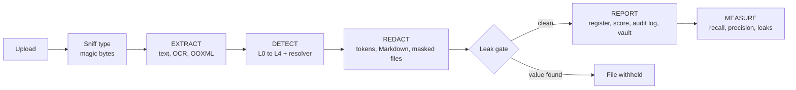

<div align="center">


# PII Shield

**Offline, fail-closed PII detection and redaction for PDFs, Office files and images.**

Hand documents to an LLM without handing over the people inside them.


[Quick start](#quick-start) · [How it works](#how-it-works) · [Dashboard](#dashboard) · [CLI](#command-line) · [Python API](#python-api) · [Quality](#measuring-quality) · [Layout](#project-layout)

</div>

---

## Why PII Shield

Sending contracts, scans and spreadsheets to a cloud LLM leaks names, IDs, e-mails and credentials. PII Shield
sits in front of the model: it finds personal data locally, replaces it with stable tokens, and proves nothing
slipped through before anything is written to disk.

- **Nothing leaves the machine.** No cloud OCR, no cloud PII API, and no LLM is used to *find* PII.
- **Fail-closed.** Unparseable files produce no output. Uncertain findings are redacted and queued for review.
  A leak gate refuses to write any masked file that still contains an original value.
- **Many formats.** PDF (text layer and scanned), DOCX, PPTX, XLSX and images, including hidden content such as
  comments, speaker notes, alt text, document properties, hidden sheets and tracked changes.
- **Consistent tokens.** `Priya Raman` becomes `[PERSON_007]` in every file of the run, so the LLM can still
  reason about who is who.
- **Auditable and measurable.** Every decision is logged, risk is scored per file, and recall, precision and
  leaks are computed against gold labels.

## Features at a glance

| | |
|---|---|
| **Extract** | Layout-aware OCR, ruled tables read cell by cell, OOXML walkers for Office files, span map back to page, element and bounding box |
| **Detect** | Rules and checksums, spaCy NER (optional GLiNER-PII), structural cues, whole-run name propagation, low-confidence OCR guard |
| **Redact** | LLM-ready Markdown, masked PDF/DOCX/PPTX/XLSX with layout preserved, metadata cleared, leak gate |
| **Report** | Exposure register (CSV/XLSX), exposure score and residual risk, audit log, AES-256-GCM token vault |
| **Measure** | Recall / precision / leaks per category and per source type, structure retention |
| **Explore** | Local React dashboard with scan control, heatmaps, findings in context, and evaluation views |

Built for the Optiv VIT case study (Case Study 2). The design rationale is in
[`01-landscape-and-recommendation.md`](01-landscape-and-recommendation.md) (Option C).

## Quick start

Requires Python 3.11+ and, for the dashboard, Node 20+.

```powershell
git clone https://github.com/krishjain-2301/optiv.git
cd optiv

python -m venv .venv
.venv\Scripts\Activate.ps1
pip install -r requirements.txt        # exact pins, includes the en_core_web_lg model wheel
python scripts/fetch_models.py         # English OCR model, ~9 MB, one-time (weights only)

cd web; npm install; npm run build; cd ..
python app.py                          # http://127.0.0.1:8000, opens the browser
```

On macOS or Linux activate the environment with `source .venv/bin/activate`.

Prefer the terminal? Skip the `web/` step and run
`python -m optiv_pii_shield run path/to/*.pdf --out out` ([details](#command-line)).

> **Missing models are errors, not fallbacks.** If the spaCy model (`--spacy-model`, default `en_core_web_lg`),
> the English OCR model or (when requested) GLiNER is not installed, the run stops before any file is read.
> Rules-only runs must be asked for explicitly with `Settings(use_spacy=False)`.

## How it works



### 1. Extract

| Source | What is read |
|---|---|
| PDF | Text layer, or layout-aware OCR for scans: ruled tables cell by cell, screenshots re-read at 2x |
| DOCX / PPTX | Body, tables, text boxes, groups, headers/footers, notes, comments, document properties, customXml, comment and tracked-change authors, embedded images (OCR), alt text, charts, SmartArt, link targets, field codes |
| XLSX | Every sheet (hidden too), cells under their column headers, formulas, comments, properties |
| Images | OCR with per-character positions |

Everything lands in a **span map**: file, page or slide, element, table cell and column header, bounding box,
OCR confidence.

### 2. Detect

| Layer | Method |
|---|---|
| **L1** Rules | Patterns, checksums and context words (inside Presidio) |
| **L2** NER | spaCy, optional GLiNER-PII (inside Presidio) |
| **L3** Structure | Column headers, `Label:` fields, document properties |
| **L4** Propagation | Every confirmed person is searched across all files: surname, initial, possessive |
| **L0** Fail-closed | Identifier-like OCR words below the confidence floor |
| **Resolver** | Trim and allow-list, merge overlaps, agreement bonus, route to redact / review / drop |

### 3. Redact

Stable tokens such as `[PERSON_007]` and `[EMAIL_007]` are shared across files. The pipeline writes redacted
Markdown for the LLM and masked PDF/DOCX/PPTX/XLSX copies with layout and page count kept and author metadata
cleared. The **leak gate** then checks that no vault value survives in any output, or the file is not written.

### 4. Report and measure

Exposure register (CSV/XLSX), exposure score and residual risk, audit log, and an encrypted token vault.
With gold labels, recall, precision and leaks are reported per category and per source type.

## Configuration

**Organisation vocabulary.** Allow-listed product and team names, always-redact names and internal ID formats
(such as `EMP-40718` or `MER-IN-0042`) live in `optiv_pii_shield/data/org.yaml`. Point `PII_SHIELD_ORG_CONFIG`
at another file for another client.

**OCR.** RapidOCR (PP-OCR on ONNX Runtime) installs with pip and needs no system binary. Two settings were
chosen from measurements on real scans:

- the **English** recognition model, because the bundled Chinese model drops spaces between English words and
  breaks name and label detection;
- the angle classifier **off**, because it flipped long lines on upright scans and silently lost sentences.

Masks use the recogniser's per-character positions and are padded, so they err towards covering a neighbouring
character rather than exposing one. Tesseract works with `--ocr tesseract` if `pytesseract` and the binary are
installed.

**GLiNER-PII (optional).** `pip install gliner`, then `python scripts/fetch_models.py --gliner` (caches about
1.8 GB once), then pass `--gliner` or use the dashboard toggle. Runs load weights from the cache only. GLiNER
hits must look like a value of their category before they count, because it also tags labels such as "E-mail"
in a table header.

**Vault key.** Set `PII_SHIELD_VAULT_KEY` (CLI) or a passphrase in the UI to write the encrypted token vault.

## Dashboard

```powershell
cd web; npm install; npm run build; cd ..   # once, and after changing web/
python app.py                               # http://127.0.0.1:8000, opens the browser
```

A FastAPI server (`server/`) on `127.0.0.1` runs the pipeline and hosts a React dashboard (`web/`). Everything
the page needs is bundled by the build: no CDN, no web fonts, nothing fetched at run time. A scan runs in a
background thread; the page shows its stage, page-by-page progress and elapsed time, and can pause or cancel it
(a cancelled scan's files are deleted). Uploads, extracted text and reports are deleted when the server stops.

| Category | Mode | Steps |
|---|---|---|
| Workspace | New scan | Sources, Detection policy, Run (uploads or synthetic samples) |
| Analytics | Overview | Summary, Files, Pipeline |
| | Exposure & risk | Ranking, Page heatmap, Residual risk |
| | Findings | Breakdown, Register, In context, Dropped candidates |
| Documents | Extraction | Preview (PDF page with PII boxed), Structure, Span map, Images |
| | Redaction | LLM text, Token map, Leak gate |
| Assurance | Evaluation | Gold labels, Scores, Errors, Structure retention |
| | Reports | Shareable, Sensitive, Session |

**Developing the UI.** Run `python app.py --no-browser` and `npm run dev` in `web/` for hot reload on
<http://localhost:5173>; it forwards `/api` to the Python server. Charts are plain HTML/SVG
(`web/src/components/charts.tsx`).

## Command line

```powershell
python -m optiv_pii_shield run path\to\*.pdf path\to\*.docx --out out
python -m optiv_pii_shield run samples\synthetic\* --out out --gold samples\synthetic\gold_labels.csv
python -m optiv_pii_shield gold-template path\to\files\* --out gold_draft.csv   # bootstrap gold labels, then correct by hand
python -m optiv_pii_shield vault-open                                           # decrypt the token vault
```

## Python API

```python
from optiv_pii_shield import run, Settings

res = run(["policy.pdf"], Settings(), out_dir="out")
res.redacted["policy.pdf"]   # LLM-safe Markdown
res.findings["policy.pdf"]   # findings with location, category, token, score, layer, reasons
```

## Outputs (per run)

`<name>` keeps the extension (`report.docx.redacted.md`), so files that share a stem never overwrite each other.
Everything with `SENSITIVE` in its name holds original values; the UI's "download all" zip is built from an
explicit allow-list of the shareable files below and never includes them.

| File | Contents | Sensitive? |
|---|---|---|
| `<name>.extracted.SENSITIVE.md` | Faithful Markdown of the source (headings, tables, image text) | **yes** |
| `<name>.redacted.md` | Same structure with PII replaced by tokens: **what goes to the LLM** | no |
| `<name>.masked.<ext>` | Masked copy of the original, same page count/layout, metadata cleared; written only if it passes the leak gate | no |
| `pii_exposure_register.csv/.xlsx` | Every finding: file, page, location, source type, category, value (partially masked), token, score, layer, reasons | no |
| `pii_exposure_register.SENSITIVE.csv` | The same with full original values | **yes** |
| `summary.json` | Per-file counts: OCR pages, images and their status, categories, image-only identifiers, warnings | no |
| `audit_log.jsonl` | Every decision including dropped candidates, values partially masked | no |
| `token_vault.SENSITIVE.enc.json` | Token → original value, AES-256-GCM encrypted; written only when `PII_SHIELD_VAULT_KEY` (CLI) or the UI passphrase is set. Open with `python -m optiv_pii_shield vault-open` | **yes** |
| `evaluation.json` | With `--gold`: recall, precision, leaks, per-category/source breakdown, structure retention | no |

## Exposure score

`summary.json` (and the dashboard’s Exposure & risk page) gives each file an exposure profile (`optiv_pii_shield/exposure.py`, weights in
`config.py`):

- **score**: sum of sensitivity weights (1-10) over every PII instance found: credentials and government or
  financial IDs 8-10, date of birth 6, address 5, phone/e-mail 4, name 3, vendor ID 1.
- **per_1k_words**, so long and short files compare; **by_page** for the page/slide heatmap.
- **rating**: `critical` if any weight ≥ 9 instance is present, else `high` / `medium` / `low` by density.
- **residual** after redaction, in three parts kept apart because they are known to different degrees:
  `known` (values left in outputs: 0 by construction, plus what the leak gate had to catch, and whether the
  masked copy was written or withheld), `unreadable` (images withheld, OCR words masked), and
  `estimated_missed` (found × miss rate from the held-out set; an estimate, with its basis recorded).

`exposure_ranking` lists files by density, so the riskiest artifacts are reviewed first.

## Fail-closed behaviour

- A file that cannot be parsed is reported and produces no output (never passed through).
- Review-band findings (`0.35 ≤ score < 0.60` by default) are **redacted** and queued for review.
- OCR words below the confidence floor that contain digits or `@` are masked as `[UNREADABLE_…]`.
- Text from images that were OCR'd with low confidence is withheld from the LLM text entirely; images that
  cannot be read at all (EMF/WMF) are removed from the masked copies. Scanned-page image regions without
  readable text (photos, badges) are blanked in the masked PDF.
- Checksums only raise or lower confidence: test-range values (SSN `9xx`, `555` phones, Aadhaar starting 0/1)
  next to a label are kept.
- Masked DOCX/PPTX lose what a reader cannot see but a parser can: tracked-change deletions, embedded objects and
  chart workbooks (charts render from their redacted caches), the thumbnail, image EXIF/XMP/text chunks. Alt text,
  chart labels, SmartArt, slide comments, link targets (`mailto:`), field codes and free-text document properties
  are extracted and redacted like body text. Masked PDFs lose annotations, form fields, attachments and mailto links.
- **Leak gate.** After tokens are assigned, every original value in the vault becomes a needle (as written,
  XML-escaped, URL-encoded, split across runs, digits-only for long numbers). The LLM text is scrubbed of any
  needle still present (reported as a warning: detection missed a mention). Each masked file is scrubbed in the
  safe places (element text, alt text, author attributes, external link targets), then every member, nested
  packages included, is searched; if a needle survives anywhere the masked file is **not written** and the run
  reports the file as withheld. Single-word person hits in the review band are not used as needles (a lone
  "Cloud" flagged by NER must not erase every "cloud"); single-word names match only as written or in capitals.
