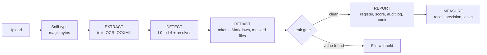

<div align="center">


# PII Shield

**Offline, fail-closed PII detection and redaction for PDFs, Office files and images.**

Hand documents to an LLM without handing over the people inside them.


[Quick start](#quick-start) · [How it works](#how-it-works) · [Dashboard](#dashboard) · [CLI](#command-line) · [Python API](#python-api) · [Quality](#measuring-quality) · [Layout](#project-layout)

</div>

---

## Why PII Shield

Sending contracts, scans and spreadsheets to a cloud LLM leaks names, IDs, e-mails and credentials. PII Shield
sits in front of the model: it finds personal data locally, replaces it with stable tokens, and proves nothing
slipped through before anything is written to disk.

- **Nothing leaves the machine.** No cloud OCR, no cloud PII API, and no LLM is used to *find* PII.
- **Fail-closed.** Unparseable files produce no output. Uncertain findings are redacted and queued for review.
  A leak gate refuses to write any masked file that still contains an original value.
- **Many formats.** PDF (text layer and scanned), DOCX, PPTX, XLSX and images, including hidden content such as
  comments, speaker notes, alt text, document properties, hidden sheets and tracked changes.
- **Consistent tokens.** `Priya Raman` becomes `[PERSON_007]` in every file of the run, so the LLM can still
  reason about who is who.
- **Auditable and measurable.** Every decision is logged, risk is scored per file, and recall, precision and
  leaks are computed against gold labels.

## Features at a glance

| | |
|---|---|
| **Extract** | Layout-aware OCR, ruled tables read cell by cell, OOXML walkers for Office files, span map back to page, element and bounding box |
| **Detect** | Rules and checksums, spaCy NER (optional GLiNER-PII), structural cues, whole-run name propagation, low-confidence OCR guard |
| **Redact** | LLM-ready Markdown, masked PDF/DOCX/PPTX/XLSX with layout preserved, metadata cleared, leak gate |
| **Report** | Exposure register (CSV/XLSX), exposure score and residual risk, audit log, AES-256-GCM token vault |
| **Measure** | Recall / precision / leaks per category and per source type, structure retention |
| **Explore** | Local React dashboard with scan control, heatmaps, findings in context, and evaluation views |

Built for the Optiv VIT case study (Case Study 2). The design rationale is in
[`01-landscape-and-recommendation.md`](01-landscape-and-recommendation.md) (Option C).

## Quick start

Requires Python 3.11+ and, for the dashboard, Node 20+.

```powershell
git clone https://github.com/krishjain-2301/optiv.git
cd optiv

python -m venv .venv
.venv\Scripts\Activate.ps1
pip install -r requirements.txt        # exact pins, includes the en_core_web_lg model wheel
python scripts/fetch_models.py         # English OCR model, ~9 MB, one-time (weights only)

cd web; npm install; npm run build; cd ..
python app.py                          # http://127.0.0.1:8000, opens the browser
```

On macOS or Linux activate the environment with `source .venv/bin/activate`.

Prefer the terminal? Skip the `web/` step and run
`python -m optiv_pii_shield run path/to/*.pdf --out out` ([details](#command-line)).

> **Missing models are errors, not fallbacks.** If the spaCy model (`--spacy-model`, default `en_core_web_lg`),
> the English OCR model or (when requested) GLiNER is not installed, the run stops before any file is read.
> Rules-only runs must be asked for explicitly with `Settings(use_spacy=False)`.

## How it works



### 1. Extract

| Source | What is read |
|---|---|
| PDF | Text layer, or layout-aware OCR for scans: ruled tables cell by cell, screenshots re-read at 2x |
| DOCX / PPTX | Body, tables, text boxes, groups, headers/footers, notes, comments, document properties, customXml, comment and tracked-change authors, embedded images (OCR), alt text, charts, SmartArt, link targets, field codes |
| XLSX | Every sheet (hidden too), cells under their column headers, formulas, comments, properties |
| Images | OCR with per-character positions |

Everything lands in a **span map**: file, page or slide, element, table cell and column header, bounding box,
OCR confidence.

### 2. Detect

| Layer | Method |
|---|---|
| **L1** Rules | Patterns, checksums and context words (inside Presidio) |
| **L2** NER | spaCy, optional GLiNER-PII (inside Presidio) |
| **L3** Structure | Column headers, `Label:` fields, document properties |
| **L4** Propagation | Every confirmed person is searched across all files: surname, initial, possessive |
| **L0** Fail-closed | Identifier-like OCR words below the confidence floor |
| **Resolver** | Trim and allow-list, merge overlaps, agreement bonus, route to redact / review / drop |

### 3. Redact

Stable tokens such as `[PERSON_007]` and `[EMAIL_007]` are shared across files. The pipeline writes redacted
Markdown for the LLM and masked PDF/DOCX/PPTX/XLSX copies with layout and page count kept and author metadata
cleared. The **leak gate** then checks that no vault value survives in any output, or the file is not written.

### 4. Report and measure

Exposure register (CSV/XLSX), exposure score and residual risk, audit log, and an encrypted token vault.
With gold labels, recall, precision and leaks are reported per category and per source type.
