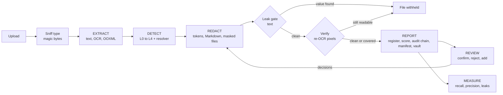

<div align="center">


# PII Shield

**Offline, fail-closed PII detection and redaction for PDFs, Office files and images.**

Hand documents to an LLM without handing over the people inside them.


[Quick start](#quick-start) · [How it works](#how-it-works) · [Dashboard](#dashboard) · [CLI](#command-line) · [Python API](#python-api) · [Quality](#measuring-quality) · [Layout](#project-layout)

</div>

---

## Why PII Shield

Sending contracts, scans and spreadsheets to a cloud LLM leaks names, IDs, e-mails and credentials. PII Shield
sits in front of the model: it finds personal data locally, replaces it with stable tokens, and proves nothing
slipped through before anything is written to disk.

- **Nothing leaves the machine.** No cloud OCR, no cloud PII API, and no LLM is used to *find* PII.
- **Fail-closed.** Unparseable files produce no output. Uncertain findings are redacted and queued for review.
  A leak gate refuses to write any masked file whose text still contains an original value, and a verification
  pass then reads every masked page and picture again by OCR, because the gate cannot see pixels.
- **Many formats.** PDF (text layer and scanned), DOCX, PPTX, XLSX, images, e-mail (`.eml`), CSV and plain text,
  including hidden content such as comments, speaker notes, alt text, document properties, PDF bookmarks, hidden
  sheets and tracked changes.
- **Consistent tokens.** `Priya Raman` becomes `[PERSON_007]` in every file of the run, so the LLM can still
  reason about who is who. With a token key the token is the same in every run, and an LLM's answer can be
  rehydrated from the vault.
- **A human in the loop.** A reviewer confirms, rejects and adds values in the dashboard; every output is
  written again.
- **Auditable and measurable.** Every decision goes into a hash-chained audit log, each run has a manifest
  (inputs, settings, model digests, output digests; Ed25519-signed when a key is set), risk is scored per file,
  and recall, precision and leaks are computed against gold labels.

## Features at a glance

| | |
|---|---|
| **Extract** | Layout-aware OCR, ruled tables read cell by cell, OOXML walkers for Office files, span map back to page, element and bounding box |
| **Detect** | Rules and checksums, spaCy NER (optional GLiNER-PII), structural cues, whole-run name propagation, low-confidence OCR guard |
| **Redact** | LLM-ready Markdown, masked copies with layout preserved, metadata cleared, faces / QR codes / unread pictures blanked, redaction profiles (GDPR, DPDP, PCI), leak gate |
| **Verify** | Every masked page and picture is OCR'd again and searched for the vault's values; what is still readable is covered, or the file is withheld |
| **Review** | Review queue, add missed values, re-redact; decisions export as gold labels |
| **Report** | Exposure register (CSV/XLSX), exposure score and residual risk, hash-chained audit log, run manifest, AES-256-GCM token vault |
| **Measure** | Recall / precision / leaks per category and per source type, structure retention |
| **Explore** | Local React dashboard with scan control, heatmaps, findings in context, original vs masked pages, and evaluation views |

Built for the Optiv VIT case study (Case Study 2). The design rationale is in
[`01-landscape-and-recommendation.md`](01-landscape-and-recommendation.md) (Option C).

## Quick start

Requires Python 3.11+ and, for the dashboard, Node 20+.

```powershell
git clone https://github.com/krishjain-2301/optiv.git
cd optiv

python -m venv .venv
.venv\Scripts\Activate.ps1
pip install -r requirements.txt        # exact pins, includes the en_core_web_lg model wheel
python scripts/fetch_models.py         # OCR and face-detection models, ~9 MB, one-time, SHA-256 checked

cd web; npm install; npm run build; cd ..
python app.py                          # http://127.0.0.1:8000, opens the browser
```

On macOS or Linux activate the environment with `source .venv/bin/activate`.

Prefer the terminal? Skip the `web/` step and run
`python -m optiv_pii_shield run path/to/*.pdf --out out` ([details](#command-line)).

> **Missing models are errors, not fallbacks.** If the spaCy model (`--spacy-model`, default `en_core_web_lg`),
> the English OCR model or (when requested) GLiNER is not installed, the run stops before any file is read.
> Rules-only runs must be asked for explicitly with `Settings(use_spacy=False)`.

## How it works



### 1. Extract

| Source | What is read |
|---|---|
| PDF | Text layer, or layout-aware OCR for scans: ruled tables cell by cell, screenshots re-read at 2x |
| DOCX / PPTX | Body, tables, text boxes, groups, headers/footers, notes, comments, document properties, customXml, comment and tracked-change authors, embedded images (OCR), alt text, charts, SmartArt, link targets, field codes |
| XLSX | Every sheet (hidden too), cells under their column headers, formulas, comments, properties |
| Images | OCR with per-character positions |
| E-mail (`.eml`) | Address headers (names and addresses apart), subject, body; attachments are not read and are dropped (scan them as files) |
| CSV / TSV, text | Cells under their column headers; paragraphs |

Pictures and scanned pages are also searched for **faces** (YuNet) and **QR codes**; both are blanked in the
masked copy. Legacy binary Office and Outlook files (`.doc`, `.xls`, `.ppt`, `.msg`) and password-protected PDFs
are refused with a message, never passed on.

Everything lands in a **span map**: file, page or slide, element, table cell and column header, bounding box,
OCR confidence.

### 2. Detect

| Layer | Method |
|---|---|
| **L1** Rules | Patterns, checksums and context words (inside Presidio) |
| **L2** NER | spaCy, optional GLiNER-PII (inside Presidio) |
| **L3** Structure | Column headers, `Label:` fields, document properties |
| **L4** Propagation | Every confirmed person is searched across all files: surname, initial, possessive |
| **L0** Fail-closed | Identifier-like OCR words below the confidence floor |
| **Resolver** | Trim and allow-list, merge overlaps, agreement bonus, route to redact / review / drop |
| **L5** Gate and reviewer | A value found in one place is redacted in every other place it appears; a reviewer's additions |

Categories: person, e-mail, phone, address (street-suffix and Indian PIN-code forms), date of birth, employee and
vendor IDs, SSN, passport, PAN, Aadhaar, PESEL, UK National Insurance number, voter ID, driving licence, tax IDs,
card, IBAN, bank account / IFSC, UPI ID, IP address, credentials, and stated health data (a special category).

### 3. Redact

Stable tokens such as `[PERSON_007]` and `[EMAIL_007]` are shared across files. The pipeline writes redacted
Markdown for the LLM and masked copies with layout and page count kept and author metadata cleared. The
**leak gate** then checks that no vault value survives in the text of any output, or the file is not written.

**Verification.** The gate reads text; a scanned page is pixels. So each masked PDF page that was OCR'd or
holds a picture, each picture left in a masked DOCX/PPTX, and each masked image is read again by OCR the way
extraction read it, and searched for every vault value. A value still readable is covered and the page is read
once more; if it cannot be covered the file is withheld. This is a second reading by the same engine, not a
proof: it catches a mask that missed, not text the engine cannot read at all. `--no-verify` turns it off.

**Pictures nobody read.** A picture with no readable text (a photo, a signature, a logo), a picture the
extractor never visited, and every picture when image OCR is off are blanked in the masked copy
(`--keep-unread-images` keeps them). Bullets and icons under 32 px are left alone.

**Profiles.** `--profile` (or the dashboard) sets what replaces each category: `default` tokenises everything;
`gdpr` generalises a date of birth to its year; `dpdp` also masks Aadhaar to its last four digits; `pci` reduces
card and account numbers to the last four. Masked and generalised values cannot be rehydrated, by design.

**Keyed tokens.** With `PII_SHIELD_TOKEN_KEY` (or the dashboard field) tokens are HMAC-SHA256 of the value:
`[PERSON_3FA9C2D1]` is the same person in every run, and cannot be computed from a guessed name without the key.

**Rehydrate.** `python -m optiv_pii_shield rehydrate vault.json answer.txt` (or Redaction → Rehydrate) puts the
original values back into text that holds tokens, and appends who did it, for which tokens and why to the audit log.

### 4. Report and measure

Exposure register (CSV/XLSX), exposure score and residual risk, audit log, and an encrypted token vault.
With gold labels, recall, precision and leaks are reported per category and per source type.

## Configuration

**Organisation vocabulary.** Allow-listed product and team names, always-redact names and internal ID formats
(such as `EMP-40718` or `MER-IN-0042`) live in `optiv_pii_shield/data/org.yaml`. Point `PII_SHIELD_ORG_CONFIG`
at another file for another client.

**OCR.** RapidOCR (PP-OCR on ONNX Runtime) installs with pip and needs no system binary. Two settings were
chosen from measurements on real scans:

- the **English** recognition model, because the bundled Chinese model drops spaces between English words and
  breaks name and label detection;
- the angle classifier **off**, because it flipped long lines on upright scans and silently lost sentences.

Masks use the recogniser's per-character positions and are padded, so they err towards covering a neighbouring
character rather than exposing one. Tesseract works with `--ocr tesseract` if `pytesseract` and the binary are
installed.

**GLiNER-PII (optional).** `pip install gliner`, then `python scripts/fetch_models.py --gliner` (caches about
1.8 GB once), then pass `--gliner` or use the dashboard toggle. Runs load weights from the cache only. GLiNER
hits must look like a value of their category before they count, because it also tags labels such as "E-mail"
in a table header.

**Vault key.** Set `PII_SHIELD_VAULT_KEY` (CLI) or a passphrase in the UI to write the encrypted token vault.

**Signing key.** `python -m optiv_pii_shield keygen keys/` writes an Ed25519 pair; set `PII_SHIELD_SIGNING_KEY`
to the `.key` file and every run manifest is signed. `verify-run out/ --pubkey keys/pii_shield_signing.pub`
checks the signature, every output's SHA-256 and the audit chain.

**Models.** The OCR and face-detection models are pinned by SHA-256 (`optiv_pii_shield/modelstore.py`) and
checked at download and at every load; GLiNER is pinned to a revision. Python dependencies are pinned to exact
versions; they are not yet hash-locked.

## Dashboard

```powershell
cd web; npm install; npm run build; cd ..   # once, and after changing web/
python app.py                               # http://127.0.0.1:8000, opens the browser
```

A FastAPI server (`server/`) on `127.0.0.1` runs the pipeline and hosts a React dashboard (`web/`). Everything
the page needs is bundled by the build: no CDN, no web fonts, nothing fetched at run time. A scan runs in a
background thread; the page shows its stage, page-by-page progress and elapsed time, and can pause or cancel it
(a cancelled scan's files are deleted). Uploads, extracted text and reports are deleted when the server stops.

The server holds original values, so it answers this machine's browser only: a request must name a loopback
Host (a page that re-points its own domain at 127.0.0.1 is refused), a request that changes anything must come
from the dashboard's own origin, responses carry a strict Content-Security-Policy and `no-store`, and uploads
are capped (`PII_SHIELD_MAX_UPLOAD_MB`, default 300). There is no login: anyone with a session on the machine
can open it.

| Category | Mode | Steps |
|---|---|---|
| Workspace | New scan | Sources, Detection policy, Run (uploads or synthetic samples) |
| Analytics | Overview | Summary, Files, Pipeline |
| | Exposure & risk | Ranking, Page heatmap, Residual risk |
| | Findings | Breakdown, Register, In context, Dropped candidates |
| Documents | Extraction | Preview (PDF page with PII boxed, beside the masked page), Structure, Span map, Images |
| | Redaction | LLM text, Token map, Leak gate, Rehydrate |
| Assurance | Review | Review queue, Add missed, Apply (outputs are written again) |
| | Evaluation | Gold labels, Scores, Errors, Structure retention (upload a hand transcription for scans) |
| | Reports | Shareable, Sensitive, Session |

**Developing the UI.** Run `python app.py --no-browser` and `npm run dev` in `web/` for hot reload on
<http://localhost:5173>; it forwards `/api` to the Python server. Charts are plain HTML/SVG
(`web/src/components/charts.tsx`).

## Command line

```powershell
python -m optiv_pii_shield run path\to\*.pdf path\to\*.docx --out out
python -m optiv_pii_shield run samples\synthetic\* --out out --gold samples\synthetic\gold_labels.csv
python -m optiv_pii_shield gold-template path\to\files\* --out gold_draft.csv   # bootstrap gold labels, then correct by hand
python -m optiv_pii_shield run files\* --out out --profile pci                   # redaction profile
python -m optiv_pii_shield vault-open out\token_vault.SENSITIVE.enc.json        # decrypt the token vault (logged)
python -m optiv_pii_shield rehydrate out\token_vault.SENSITIVE.enc.json answer.txt --purpose "audit query"
python -m optiv_pii_shield keygen keys                                          # Ed25519 pair for signing manifests
python -m optiv_pii_shield verify-run out                                       # manifest, output digests, audit chain
```

## Python API

```python
from optiv_pii_shield import run, Settings

res = run(["policy.pdf"], Settings(), out_dir="out")
res.redacted["policy.pdf"]   # LLM-safe Markdown
res.findings["policy.pdf"]   # findings with location, category, token, score, layer, reasons

from optiv_pii_shield.pipeline import apply_review
from optiv_pii_shield.review import Addition, Decision
apply_review(res, [Decision("PERSON", "Cloud", "reject")], [Addition("R. Mendoza", "PERSON")], operator="me")
```

## Outputs (per run)

`<name>` keeps the extension (`report.docx.redacted.md`), so files that share a stem never overwrite each other.
Everything with `SENSITIVE` in its name holds original values; the UI's "download all" zip is built from an
explicit allow-list of the shareable files below and never includes them.

| File | Contents | Sensitive? |
|---|---|---|
| `<name>.extracted.SENSITIVE.md` | Faithful Markdown of the source (headings, tables, image text) | **yes** |
| `<name>.redacted.md` | Same structure with PII replaced by tokens: **what goes to the LLM** | no |
| `<name>.masked.<ext>` | Masked copy of the original, same page count/layout, metadata cleared; written only if it passes the leak gate | no |
| `pii_exposure_register.csv/.xlsx` | Every finding: file, page, location, source type, category, value (partially masked), token, score, layer, reasons | no |
| `pii_exposure_register.SENSITIVE.csv` | The same with full original values | **yes** |
| `summary.json` | Per-file counts: OCR pages, images and their status, categories, image-only identifiers, warnings | no |
| `audit_log.jsonl` | Append-only, hash-chained: the run, every decision including dropped candidates (values partially masked), reviews, re-identifications | no |
| `run_manifest.json` | Operator, inputs and their SHA-256, settings, versions, model digests, gate and verification outcome per file, SHA-256 of every output, audit head; Ed25519 signature when a key is set | no |
| `token_vault.SENSITIVE.enc.json` | Token → original value, AES-256-GCM encrypted; written only when `PII_SHIELD_VAULT_KEY` (CLI) or the UI passphrase is set. Open with `python -m optiv_pii_shield vault-open` | **yes** |
| `evaluation.json` | With `--gold`: recall, precision, leaks, per-category/source breakdown, structure retention | no |

## Exposure score

`summary.json` (and the dashboard’s Exposure & risk page) gives each file an exposure profile (`optiv_pii_shield/exposure.py`, weights in
`config.py`):

- **score**: sum of sensitivity weights (1-10) over every PII instance found: credentials and government or
  financial IDs 8-10, date of birth 6, address 5, phone/e-mail 4, name 3, vendor ID 1.
- **per_1k_words**, so long and short files compare; **by_page** for the page/slide heatmap.
- **rating**: `critical` if any weight ≥ 9 instance is present, else `high` / `medium` / `low` by density.
- **residual** after redaction, in three parts kept apart because they are known to different degrees:
  `known` (values left in outputs: 0 by construction, plus what the leak gate had to catch, and whether the
  masked copy was written or withheld), `unreadable` (images withheld, OCR words masked), and
  `estimated_missed` (found × miss rate from the held-out set; an estimate, with its basis recorded).

`exposure_ranking` lists files by density, so the riskiest artifacts are reviewed first.

## Fail-closed behaviour

- A file that cannot be parsed is reported and produces no output (never passed through).
- Review-band findings (`0.35 ≤ score < 0.60` by default) are **redacted** and queued for review.
- OCR words below the confidence floor that contain digits or `@` are masked as `[UNREADABLE_…]`.
- Text from images that were OCR'd with low confidence is withheld from the LLM text entirely; images that
  cannot be read at all (EMF/WMF) are removed from the masked copies. Pictures without readable text (photos,
  badges, signatures), faces and QR codes are blanked in every masked format.
- Masked copies are read again by OCR (see Verification); a value still readable is covered or the file is withheld.
- Two inputs with the same name are both kept (`report.pdf`, `report~2.pdf`), never overwritten.
- Checksums only raise or lower confidence: test-range values (SSN `9xx`, `555` phones, Aadhaar starting 0/1)
  next to a label are kept.
- Masked DOCX/PPTX lose what a reader cannot see but a parser can: tracked-change deletions, embedded objects and
  chart workbooks (charts render from their redacted caches), the thumbnail, image EXIF/XMP/text chunks. Alt text,
  chart labels, SmartArt, slide comments, link targets (`mailto:`), field codes and free-text document properties
  are extracted and redacted like body text. Masked PDFs lose annotations, form fields, attachments and mailto
  links; their bookmarks are redacted like text.
- **Leak gate.** After tokens are assigned, every original value in the vault becomes a needle (as written,
  XML-escaped, URL-encoded, split across runs, digits-only for long numbers). Every place a needle appears where
  no detector fired becomes a finding of its own (layer "L5 leak gate"), so it is redacted in the LLM text *and*
  covered in the masked file, including on scanned pages. Each masked file is scrubbed in the
  safe places (element text, alt text, author attributes, external link targets), then every member, nested
  packages included, is searched; if a needle survives anywhere the masked file is **not written** and the run
  reports the file as withheld. Single-word person hits in the review band are not used as needles (a lone
  "Cloud" flagged by NER must not erase every "cloud"); single-word names match only as written or in capitals.

## Measuring quality

Recall is only reported against gold labels. Format (one row per PII instance):

```csv
file,page,text,category,context_type,note
risk_policy.pdf,3,Priya Raman,PERSON,narrative,
org_pack.pptx,1,+1 (555) 0114,PHONE_NUMBER,table,
```

`context_type` ∈ `native | labelled | table | narrative | image | metadata` drives the per-source breakdown
(Appendix E.6 prompts 2 and 3). Structure retention is computed from the raw OOXML for DOCX/PPTX, and against an
optional hand transcription (`--transcriptions dir/` with `<stem>.txt`) for OCR'd PDFs.

### Synthetic fixtures

`python scripts/make_samples.py samples/synthetic` builds a scanned PDF, a DOCX and a PPTX with invented people
that reproduce the traps found in the real samples (no text layer, ruled tables with multi-line cells,
screenshot text, unlabelled narrative with possessives and surname-only mentions, `.example` e-mails, `+1 (555) 0114`
phones, glued DOCX cells, field names that look like names, author metadata) and writes `gold_labels.csv`.

## Tests

```powershell
pytest -q
```

Unit tests cover validators, rules, name handling and structure; integration tests run the full pipeline on the
synthetic fixtures and check recall/precision floors, leaks in the redacted text and masked files, token stability,
traceability of every finding, structure retention and report outputs. `tests/test_leaks.py` plants values in
hidden places (mailto targets, field codes, tracked deletions, description, alt text, PNG metadata, chart caches,
embedded workbooks, thumbnails) and searches every part of the masked files for them.

`tests/test_hardening.py` covers the verification pass (an unmasked scan passes the text gate and is caught by
re-OCR), blanked pictures, bookmarks, the text formats, review, the audit chain and manifest (a removed line, an
edited line and an edited output are each detected), keyed tokens, profiles and rehydration. The main fixture
run happens with sockets and name lookups blocked, and a test asserts that nothing tried to connect.

CI (`.github/workflows/ci.yml`) installs the pinned dependencies, lints (`ruff`), audits the
pins (`pip-audit`, `npm audit`), builds and type-checks the dashboard, and runs the full suite on Windows.

### Held-out set

The fixture scores (recall 1.000, precision 0.987 on 76 labels) are optimistic: the fixtures were written
alongside the detectors. `scripts/make_heldout.py` generates a separate set with Faker (en_IN, pl_PL, de_DE,
es_ES, en_GB, en_US), with ALL-CAPS, lowercase and OCR-noise variants, sentences with and without keywords, and
decoy paragraphs. Leaks are counted strictly on the LLM text (a surname left beside a token is a leak). Seed
`dev` is used for fixing general failure classes; seed `test` is reported (`tests/test_heldout.py`).

Test seed, 219 instances (`en_core_web_lg`):

| | caught |
|---|---|
| Phones, e-mails, IPs, IBANs, cards, SSN, Aadhaar | 104/104 |
| Person names, all variants | 90/115 |
| ... Title case | 58/60 |
| ... ALL CAPS | 20/23 |
| ... OCR noise (1–2 digit-for-letter swaps) | 9/15 |
| ... lowercase | 3/17 |
| Decoy paragraphs (false positives) | 0 tokens in 20 |

The test seed was inspected once, before one fix: a labelled Aadhaar starting with `1` leaked and the Aadhaar
rule was widened (labelled → review band). Treat the Aadhaar line as no longer held out.

**Known limits.** NER is English (`en_core_web_lg`); names in other scripts are found only by structure, the
gazetteer or a reviewer. Signatures drawn on a scanned page are not detected. Verification is a second OCR
reading, not a proof. Names leak when no layer has evidence: lowercase names whose given name is not in
`optiv_pii_shield/data/given_names.txt`, Title-case non-English names that spaCy's English model does not tag and
that no keyword, header or confirmed mention supports, and names garbled by OCR beyond one or two digit
confusions. GLiNER (`--gliner`, `knowledgator/gliner-pii-base-v1.0`, gliner 0.2.29) was measured once on the test
seed on 2026-10-03: person names 93/115 instead of 90/115 (lowercase unchanged), structured identifiers still
104/104, but 8 tokens in the 20 decoy paragraphs instead of 0, and detection about 10x slower on CPU. It is a
small recall gain bought with false positives, so it stays off by default.

## Project layout

```
optiv_pii_shield/
  config.py            thresholds, header→category map, context words, sensitivity weights, redaction profiles
  modelstore.py        model files pinned by SHA-256
  audit.py             hash-chained audit log, run manifest, signing, verify-run
  review.py            review queue, reviewer decisions and additions
  data/                org.yaml (allow-list, deny-list, ID formats), given_names.txt (gazetteer)
  models.py            Span / Word / ImageRef / Document / Finding
  extract/             sniff, pdf, docx, pptx, xlsx, image, plain (text/CSV/e-mail), ooxml walkers, layout
                       (tables/regions), ocr backends, visual (faces, QR codes)
  detect/              rules + validators (L1), ner (L2), structure (L3), propagation (L4), resolver
  redact/              tokens (vault, keyed tokens, profiles, rehydrate), text (LLM output), files (masked
                       copies), leakcheck (text gate), verify (re-OCR of masked copies)
  exposure.py          exposure score and residual risk
  workspace.py         per-session working folders and their removal
  render.py            spans → Markdown (shared by extracted and redacted views)
  report.py            exposure register, summary, audit log
  evaluate.py          gold labels, recall/precision/leaks, structure retention
  pipeline.py, cli.py
app.py                 starts the dashboard server and opens the browser
server/
  api.py               FastAPI routes (/api/scan, /api/run, ...) and hosting of web/dist
  session.py           the one local session: working folder, background scan (progress, pause, cancel), result
  payloads.py          the JSON the dashboard is sent: the run, one document's detail, the evaluation
web/                   React + TypeScript dashboard (Vite)
  src/api.ts           types of the server's JSON and the calls that fetch it
  src/store.tsx        app state: current run, scan in progress, scan settings, queued files
  src/components/      header, step bar, stat tiles, cards, charts, table, form controls
  src/pages/           one file per mode: Scan, Overview, Exposure, Findings, Extraction, Redaction,
                       Review, Evaluation, Reports
  src/lib/entities.ts  entity labels, category groups and chart colours
scripts/               make_samples (fixtures), make_heldout (held-out set), fetch_models, run_extract
tests/
```

## Contributing

1. Branch from `main`, keep commits small and focused.
2. Run `pytest -q`, `ruff check .` and `cd web && npm run typecheck` before pushing.
3. Open a pull request describing what changed and why.

Never commit real documents or real PII; use the synthetic fixtures.
